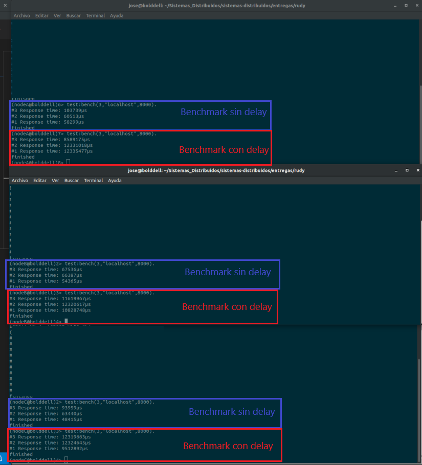

Rudy
=====

Useful commands
-----
- Build
    
    >$ rebar3 compile

- Shell
    
    >$ rebar3 shell

- Recompile inside shell

    >1>r3:do(compile)

## Desarrollo

Comenzamos implementando el servidor tal cual lo indicaba el ejercicio. No
tuvimos complicaciones al respecto. Probamos hacer peticiones desde una consola
en otra pc y desde el navegador.

## Preguntas
Las preguntas que respondimos son las siguientes:

### a) ¿cuántos requests por segundo podemos servir?

#### Sin Delay

116789μs(0,12s aprox).

#### Con Delay

4259658μs(4.25s aprox).

### b) ¿Nuestro delay artificial es importante o desaparece dentro del overhead de parsing? 

Parece importar dado que los tiempos de respuesta empeoran enórmemente en presencia del delay.

### c) ¿Qué ocurre si ejecutamos los benchmarks en varias máquinas al mismo tiempo? 

En el caso sin delay, los tiempos de respuesta se mantienen. En el caso de tener el delay,
los tiempos de respuesta empeoran aún más. 

### Benchmarks

## Discusión

### a) ¿Deberíamos crear un nuevo proceso por cada request de entrada? 

Si, siempre y cuando la cantidad de request de entrada, sea acorde, a la cantidad de concurrencia que soporta la cpu. En caso de que hayan picos de demanda, no seria rentable tener muchos procesos compitiendo para ser procesados, y podria llegar a darse el caso de que los recursos se agoten.

### b) ¿Toma tiempo crear un nuevo proceso? 

No.

### c) ¿Qué ocurriría si tenemos miles de requests por minuto?

Dependiendo de la cantidad de procesos que tengamos, puede tardar mas o menos. En el caso de crear un proceso por request, se podria generar un cuello de botella o, en el peor de los casos, matar el proceso principal. Por esta razon, la mayoria de los servidores http, utilizan un pool de conexiones determinado, donde se recomienda que sea acorde a la cantidad de procesos o threads que pueda soportar el mismo (dependiendo del hardware).

### Post-clase

No habiamos podido encontrar la vuelta de hacer concurrente las requests, pero despues de verlo en clase, nos quedo mas claro, y lo pudimos agregar en el servidor http. Ademas, vimos que se puede mejorar concurrentemente el benchmark, para mejorar las request. 
En esto ultimo, tratamos de realizarlo de dos partes, donde la primera era levantar un proceso para cada request del benchmark, pero nos dimos cuenta que el tiempo era demasiado menor, debido a que no se esperaba a que efectivamente se terminen todas las request. Por eso, a esto ultimo le agregamos que cada proceso, le mande un mensaje al proceso principal, que se queda esperando a que todos terminen (con una funcion recursiva con recieve, la cual si se recibie N mensajes de la cant total de request finalizaba con un atom). Sin embargo, segun nuestras pruebas, tardaba mas que el secuencial que tenemos actualmente. Por este motivo, no esta subido en el repo.

